# Chapter 4: Implementation

This chapter presents the work completed during the initial 30% implementation phase of the DeTrust system. It outlines the core functionality developed at this stage and explains how these components were designed and integrated. The focus is on the essential logic that governs system behavior, particularly the mechanisms that enforce business rules and manage blockchain interactions. The chapter also describes the methodological steps followed and provides the key algorithms that support the implemented features.

**Project:** DeTrust - Decentralized Trust & Capability Scoring System for Freelancers  
**Institution:** COMSATS University, Islamabad, Pakistan  
**Authors:** Haseeb Ahmad Khalil (CIIT/FA22-BCS-027/ISB), Noor-Ul-Huda (CIIT/FA22-BCS-081/ISB)  
**Supervisor:** Dr. Tehsin Kanwal

---

## Table of Contents

1. [4.0 System Architecture](#40-system-architecture)
   - [4.0.1 High-Level Architecture Diagram](#401-high-level-architecture-diagram)
   - [4.0.2 Component Architecture Diagram](#402-component-architecture-diagram)
   - [4.0.3 Database Schema Diagram](#403-database-schema-diagram)
   - [4.0.4 Data Flow Diagram](#404-data-flow-diagram)
   - [4.0.5 Smart Contract Interaction Diagram](#405-smart-contract-interaction-diagram)
   - [4.0.6 Architecture Summary Table](#406-architecture-summary-table)
2. [4.1 Project Methodology & Algorithms](#41-project-methodology--algorithms)
   - [4.1.1 Project Methodology (Step-by-Step Approach)](#411-project-methodology-step-by-step-approach)
   - [4.1.2 Algorithms](#412-algorithms)
3. [4.2 Training Results & Model Evaluation](#42-training-results--model-evaluation)
4. [4.3 Security Techniques](#43-security-techniques)
5. [4.4 External APIs/SDKs](#44-external-apissdks)
6. [4.5 User Interface](#45-user-interface)
7. [4.6 Deployment](#46-deployment)

---

## 4.0 System Architecture

This section presents the hybrid monolithic architecture of the DeTrust system. The architecture combines a traditional monolithic backend with decentralized blockchain components and an AI microservice, creating a robust and scalable system.

### 4.0.1 High-Level Architecture Diagram

The following Mermaid diagram illustrates the complete system architecture:

```mermaid
%%{init: {'theme': 'base', 'themeVariables': { 'primaryColor': '#4F46E5', 'primaryTextColor': '#fff', 'primaryBorderColor': '#3730A3', 'lineColor': '#6366F1', 'secondaryColor': '#10B981', 'tertiaryColor': '#F3F4F6'}}}%%
flowchart TB
    subgraph CLIENT["🌐 Client Layer"]
        direction TB
        WEB["🖥️ Next.js 15 Web App<br/>(Port: 3000)"]
        WALLET["🦊 Web3 Wallets<br/>(MetaMask / WalletConnect)"]
    end

    subgraph MONOLITH["📦 Hybrid Monolithic Backend"]
        direction TB
        
        subgraph API["🔧 Express.js API Server (Port: 4000)"]
            direction LR
            
            subgraph CONTROLLERS["Controllers"]
                AUTH_CTRL["Auth<br/>Controller"]
                USER_CTRL["User<br/>Controller"]
                JOB_CTRL["Job<br/>Controller"]
                CONTRACT_CTRL["Contract<br/>Controller"]
                PROPOSAL_CTRL["Proposal<br/>Controller"]
                REVIEW_CTRL["Review<br/>Controller"]
                DISPUTE_CTRL["Dispute<br/>Controller"]
                MSG_CTRL["Message<br/>Controller"]
                ADMIN_CTRL["Admin<br/>Controller"]
            end
            
            subgraph SERVICES["Services"]
                AUTH_SVC["Auth<br/>Service"]
                USER_SVC["User<br/>Service"]
                JOB_SVC["Job<br/>Service"]
                CONTRACT_SVC["Contract<br/>Service"]
                PROPOSAL_SVC["Proposal<br/>Service"]
                REVIEW_SVC["Review<br/>Service"]
                DISPUTE_SVC["Dispute<br/>Service"]
                BLOCKCHAIN_SVC["Blockchain<br/>Service"]
                TRUST_SVC["Trust Score<br/>Service"]
                NOTIFICATION_SVC["Notification<br/>Service"]
                IPFS_SVC["IPFS<br/>Service"]
            end
            
            subgraph MIDDLEWARE["Middleware"]
                AUTH_MW["JWT Auth"]
                RATE_MW["Rate Limiter"]
                VALIDATION_MW["Zod Validation"]
                ERROR_MW["Error Handler"]
            end
        end
        
        subgraph REALTIME["⚡ Real-Time Layer"]
            SOCKET["Socket.io Server"]
            EVENTS["Event Emitter"]
        end
        
        subgraph JOBS["⏰ Background Jobs"]
            BULL["BullMQ Queue"]
            WORKER["Job Workers"]
        end
    end

    subgraph AI["🤖 AI Microservice"]
        direction TB
        FASTAPI["FastAPI Server<br/>(Port: 8000)"]
        ML_MODEL["ML Models"]
        PREDICTION["Capability<br/>Prediction"]
        VERIFICATION["Skill<br/>Verification"]
    end

    subgraph BLOCKCHAIN["⛓️ Blockchain Layer (Polygon/Ethereum)"]
        direction TB
        
        subgraph CONTRACTS["Smart Contracts"]
            ESCROW["JobEscrow.sol<br/>• createJob()<br/>• lockPayment()<br/>• releaseFunds()"]
            REPUTATION["ReputationRegistry.sol<br/>• recordFeedback()<br/>• getUserRating()"]
            DISPUTE_SC["DisputeResolution.sol<br/>• createDispute()<br/>• castVote()<br/>• resolveDispute()"]
            FACTORY["DeTrustFactory.sol<br/>• deployContracts()"]
        end
        
        RPC["JSON-RPC Provider<br/>(Infura/Alchemy)"]
    end

    subgraph DATA["💾 Data Layer"]
        direction TB
        POSTGRES[("PostgreSQL<br/>Primary Database")]
        REDIS[("Redis<br/>Cache & Sessions")]
        IPFS_STORAGE["IPFS (Pinata)<br/>File Storage"]
    end

    subgraph SHARED["📚 Shared Packages"]
        direction LR
        PRISMA["@detrust/database<br/>(Prisma ORM)"]
        TYPES["@detrust/types<br/>(TypeScript Types)"]
        CONTRACT_PKG["@detrust/contracts<br/>(ABIs & Typechain)"]
        CONFIG["@detrust/config<br/>(Shared Config)"]
    end

    %% Client connections
    WEB -->|"HTTP/REST"| API
    WEB -->|"WebSocket"| SOCKET
    WALLET -->|"JSON-RPC"| RPC
    WEB -.->|"Sign Transactions"| WALLET

    %% API internal flow
    CONTROLLERS --> SERVICES
    MIDDLEWARE --> CONTROLLERS
    
    %% Services to Data
    SERVICES -->|"Prisma"| POSTGRES
    SERVICES -->|"Cache"| REDIS
    IPFS_SVC -->|"Pin Files"| IPFS_STORAGE
    BLOCKCHAIN_SVC -->|"ethers.js"| RPC
    
    %% Real-time connections
    EVENTS --> SOCKET
    NOTIFICATION_SVC --> EVENTS
    
    %% Background jobs
    SERVICES --> BULL
    BULL --> WORKER
    WORKER -->|"Process Tasks"| SERVICES
    
    %% AI Service connections
    API -->|"HTTP"| FASTAPI
    FASTAPI --> ML_MODEL
    ML_MODEL --> PREDICTION
    ML_MODEL --> VERIFICATION
    
    %% Blockchain connections
    RPC --> CONTRACTS
    ESCROW -.->|"Events"| BLOCKCHAIN_SVC
    REPUTATION -.->|"Events"| BLOCKCHAIN_SVC
    DISPUTE_SC -.->|"Events"| BLOCKCHAIN_SVC
    
    %% Shared package usage
    PRISMA -.-> API
    TYPES -.-> WEB
    TYPES -.-> API
    CONTRACT_PKG -.-> WEB
    CONTRACT_PKG -.-> API

    %% Styling
    classDef clientStyle fill:#818CF8,stroke:#4F46E5,color:#fff
    classDef apiStyle fill:#34D399,stroke:#10B981,color:#fff
    classDef blockchainStyle fill:#FBBF24,stroke:#F59E0B,color:#000
    classDef dataStyle fill:#60A5FA,stroke:#3B82F6,color:#fff
    classDef aiStyle fill:#F472B6,stroke:#EC4899,color:#fff
    
    class WEB,WALLET clientStyle
    class API,SOCKET,BULL apiStyle
    class ESCROW,REPUTATION,DISPUTE_SC,FACTORY,RPC blockchainStyle
    class POSTGRES,REDIS,IPFS_STORAGE dataStyle
    class FASTAPI,ML_MODEL,PREDICTION,VERIFICATION aiStyle
```



### 4.0.2 Component Architecture Diagram

The following diagram shows the detailed component relationships within each module:


### 4.0.3 Database Schema Diagram


### 4.0.4 Data Flow Diagram


### 4.0.5 Smart Contract Interaction Diagram


### 4.0.6 Architecture Summary Table

| Component | Technology | Purpose | Port |
|-----------|------------|---------|------|
| **Web Frontend** | Next.js 15, React, TailwindCSS | User interface, wallet integration | 3000 |
| **API Backend** | Express.js, TypeScript | REST API, business logic, event handling | 4000 |
| **AI Service** | FastAPI, Python, scikit-learn | Capability prediction, skill verification | 8000 |
| **Database** | PostgreSQL, Prisma ORM | Persistent data storage | 5432 |
| **Cache** | Redis | Session storage, caching, job queues | 6379 |
| **Blockchain** | Polygon (Ethereum L2) | Smart contracts, escrow, reputation | - |
| **File Storage** | IPFS (Pinata) | Decentralized file storage | - |
| **Smart Contracts** | Solidity, Hardhat | Payment escrow, reputation, disputes | - |

---

## 4.1 Project Methodology & Algorithms

This section outlines the step-by-step approach used during implementation and highlights the key algorithms that drive the system's core functionality. The focus is on meaningful logic rather than basic operations, emphasizing the processes that enforce business rules, maintain secure and consistent workflows, and support the system's decision-making capabilities.

### 4.1.1 Project Methodology (Step-by-Step Approach)

The methodology for the implemented DeTrust system is given below:

#### 1. Data Collection

**What:**
- User profile information was collected, including wallet address, display name, role, skills, bio, and portfolio links.
- Job data was gathered, such as job ID, title, summary, required skills, budget, deadline, client wallet, and on-chain references.
- Smart-contract events and transactions were captured, including `JobCreated`, `PaymentLocked`, and `JobStatusUpdated` with logs and timestamps.
- Payment records were stored, covering amount, token type, transaction hash, payer wallet, and timestamp.
- Application logs were maintained for authentication attempts, API requests, and system errors.

**How:**
- The frontend sends profile and job data as JSON over secure REST endpoints to the backend.
- A backend event listener (using ethers.js) captures smart-contract events, processes them, and stores structured records in the database.
- Transaction receipts are monitored until confirmed and then saved with their metadata.
- All data is stored in PostgreSQL, with JSONB fields used for flexible job and event detail.

**Why:**
- Profile and job data are essential for rendering the job board and enabling accurate searching and filtering.
- On-chain events and receipts provide a verifiable audit trail and serve as the trusted source for job lifecycle and payments.
- Application logs help in debugging, preventing replay attacks through nonce verification, and supporting basic analytics.

#### 2. Data Preprocessing

**Missing Values:**
- Required fields are validated at the API level, and submissions missing essentials are rejected.
- Optional fields (e.g., portfolio links, secondary skills) are stored as null or empty arrays.
- Missing numeric values are flagged and excluded from aggregated calculations.

**Duplicates:**
- Each job is uniquely identified through its on-chain `jobId`, with checks on both `jobId` and transaction hash.
- User profiles remain unique through the wallet address constraint.

**Normalization:**
- Skill tags are standardized by trimming, lowercasing, and removing duplicates.
- Dates are converted to ISO 8601 in UTC for consistency.
- Monetary values are stored in the smallest unit to avoid precision issues.
- Job summaries are trimmed for UI previews, with full versions saved in JSONB.

#### 3. Feature Extraction & Selection

**What:**
- Profile features like skill count, portfolio items, profile completeness, and account age.
- Job features including budget, number of required skills, deadline duration, and summary length.
- Transaction features such as payment lock status, time to lock, and confirmation count.
- Event-based features like status change counts, with placeholders for future dispute or response-time metrics.

**How:**
- A backend worker processes database records and generates feature values stored in a JSONB features table.
- Counts, averages, and time differences are computed via SQL, while text-based measures are handled in the application logic.
- Each feature set is saved with its `jobId` and timestamp for traceability.

#### 4. Model Training

**Status:** *Not applicable at this stage.*

AI/ML model training is not implemented in the 30% milestone because the system has not yet generated enough user activity data to support model development. The full training process will be completed in later phases once adequate data is available.

#### 5. Advanced Techniques

**NLP:**
- Not used at this stage. Text fields are simply stored and cleaned so they can be processed by future NLP components if needed.

**Blockchain:**
- Key job actions such as summary hashes, job IDs, and payment locks are recorded through smart-contract events, which act as the authoritative source of information. The backend updates its database based on these events, ensuring that all records remain immutable and fully auditable.

**Computer Vision:**
- Not applicable at this stage. No image-based analysis is required for current functionality.

#### 6. Deployment

**What:**
- Frontend (Next.js/React) deployed to a staging environment (Vercel).
- Backend APIs and worker processes deployed to a managed container environment (Render/Railway/Docker on cloud).
- Smart contracts compiled and deployed to a public testnet (Polygon Mumbai) via Hardhat; verified where applicable.

**How:**
- CI pipeline builds frontend and backend on commit; test suite runs including Hardhat contract tests and API integration tests.
- Backend service runs an event listener that subscribes to the blockchain provider (Infura/Alchemy or direct RPC) and reconciles events into PostgreSQL.
- Environment variables (RPC URLs, private keys, DB credentials) are stored securely.

**Why:**
- Deploying to a testnet makes it possible to test wallet interactions and escrow functions end-to-end without any production risk.
- The staging environment helps validate the user interface and gather early feedback, while still keeping all activity traceable through testnet transactions.

---

### 4.1.2 Algorithms

This section outlines the main algorithms implemented at this stage, focusing on those that enforce core business rules and support essential system operations. Each algorithm is described with its name, inputs, outputs, and pseudocode. The algorithms included here cover wallet authentication, job creation, escrow payment locking, blockchain event synchronization, and job filtering.

**Table 4.1: Implemented Algorithms**

---

#### Algorithm 1: Wallet Authentication (Authentication Rule Enforcement)

| Attribute | Details |
|-----------|---------|
| **Algorithm Name** | VerifyWalletSignature |
| **Input** | walletAddress, signature |
| **Output** | sessionToken or "Failure" |

**Pseudocode:**

```
1:  procedure VerifyWalletSignature(walletAddress, signature)
2:      nonce <- GetStoredNonce(walletAddress)
3:      if nonce is null then
4:          return "Expired or missing nonce"
5:      end if
6:      expectedMessage <- "Login verification: " + nonce
7:      signer <- RecoverSigner(expectedMessage, signature)
8:      if signer == walletAddress then
9:          DeleteNonce(walletAddress)
10:         token <- GenerateUserSession(walletAddress)
11:         return token
12:     else
13:         return "Invalid signature"
14:     end if
15: end procedure
```

**Description:** This algorithm enforces wallet-based authentication by verifying that a user controls the claimed wallet address. The server generates a one-time nonce, which the user signs with their private key. The backend recovers the signer's address from the signature and compares it with the claimed wallet address. If they match, a session token is issued.

---

#### Algorithm 2: Job Creation (Business Rule Enforcement)

| Attribute | Details |
|-----------|---------|
| **Algorithm Name** | CreateJob |
| **Input** | clientWallet, jobData |
| **Output** | jobId |

**Pseudocode:**

```
1:  procedure CreateJob(clientWallet, jobData)
2:      Validate(jobData)
3:      summaryHash <- Hash(jobData.title + jobData.description)
4:      tx <- SmartContract.CreateJob(summaryHash, jobData.budget)
5:      jobId <- ExtractEvent(tx, "JobCreated")
6:      SaveOffChain(jobId, jobData, "Open")
7:      return jobId
8:  end procedure
```

**Description:** This algorithm handles the creation of new jobs on the platform. It validates the job data, creates a hash of the job summary for on-chain storage, invokes the smart contract to register the job, extracts the generated job ID from the emitted event, and saves the full job details off-chain in PostgreSQL.

---

#### Algorithm 3: Escrow Payment Lock (Business Rule Enforcement)

| Attribute | Details |
|-----------|---------|
| **Algorithm Name** | LockJobPayment |
| **Input** | jobId, amount |
| **Output** | "Success" or "Failure" |

**Pseudocode:**

```
1:  procedure LockJobPayment(jobId, amount)
2:      job <- FetchJob(jobId)
3:      if job.status != "Open" then
4:          return "Payment not allowed"
5:      end if
6:      tx <- SmartContract.LockPayment(jobId, amount)
7:      if tx.success then
8:          UpdateJobStatus(jobId, "In Progress")
9:          return "Success"
10:     else
11:         return "Transaction failed"
12:     end if
13: end procedure
```

**Description:** This algorithm manages the escrow payment locking mechanism. When a client decides to proceed with a freelancer, they lock the payment amount in the smart contract escrow. The algorithm verifies that the job is in "Open" status before allowing the payment lock, then updates the job status to "In Progress" upon successful transaction.

---

#### Algorithm 4: Blockchain Event Synchronization (Scheduling/State Maintenance)

| Attribute | Details |
|-----------|---------|
| **Algorithm Name** | ListenToContractEvents |
| **Input** | contractEvents (stream) |
| **Output** | Updated off-chain records |

**Pseudocode:**

```
1:  process ListenToContractEvents()
2:      On Event JobCreated(jobId):
3:          EnsureOffChainRecord(jobId)
4:      On Event PaymentLocked(jobId):
5:          UpdateJobStatus(jobId, "In Progress")
6:      On Event JobStatusUpdated(jobId, newStatus):
7:          UpdateJobStatus(jobId, newStatus)
8:  end process
```

**Description:** This background process maintains synchronization between the blockchain state and the off-chain database. It listens for smart contract events and updates the PostgreSQL database accordingly. This ensures that the application's state remains consistent with the immutable on-chain records.

---

#### Algorithm 5: Job Filtering (Optimization)

| Attribute | Details |
|-----------|---------|
| **Algorithm Name** | FilterJobs |
| **Input** | criteria (skills, budgetRange, status) |
| **Output** | filteredJobList |

**Pseudocode:**

```
1:  function FilterJobs(criteria)
2:      results <- QueryJobs(criteria.budgetRange, criteria.status)
3:      if criteria.skills is not empty then
4:          results <- FilterBySkillMatch(results, criteria.skills)
5:      end if
6:      return results
7:  end function
```

**Description:** This algorithm provides efficient job filtering for freelancers browsing the job board. It first narrows down jobs by budget range and status using indexed database queries, then applies skill matching as a secondary filter. This two-stage approach optimizes query performance while providing accurate results.

---

## 4.2 Training Results & Model Evaluation

**Status:** AI/ML training and evaluation are not part of the 30% milestone because the system has not yet generated enough user activity data to support model development. At this stage, no dataset has been compiled, no preprocessing steps have been carried out, and no models have been trained. The full training process, along with performance metrics and evaluation visuals, will be completed in later phases once adequate data is available.

---

## 4.3 Security Techniques

This section describes the security measures implemented in the DeTrust system to protect user data, prevent common attacks, and ensure secure transactions.

### 4.3.1 Authentication (Wallet-Based)

A wallet-based authentication approach is implemented, where users verify their identity by signing a server-generated nonce instead of using traditional passwords. The backend checks this signature against the user's wallet address and, once validated, issues a secure session token. This method protects against credential theft, replay attacks, and unauthorized access.

**Implementation Details:**
- Server generates a unique nonce for each login attempt
- User signs the nonce message using their wallet's private key (via MetaMask or WalletConnect)
- Backend uses ethers.js to recover the signer's address from the signature
- One-time nonces are invalidated immediately after use
- Session tokens are issued as JWT with configurable expiration

### 4.3.2 Encryption (HTTPS/TLS)

All communication between the frontend and backend is secured using HTTPS (TLS 1.2+), ensuring encrypted transfer of profile, job, and event data. Sensitive identifiers such as wallet addresses, transaction hashes, and session tokens are stored securely. Additional encryption layers are not required at this stage, as authentication already relies on the strong cryptographic signing provided by blockchain wallets (ECDSA).

### 4.3.3 Attack Prevention

**SQL Injection Prevention:**
- User inputs are handled through parameterized queries and ORM-level sanitization (Prisma ORM)
- All database operations use prepared statements
- Input validation rejects malformed data at the API boundary

**XSS Prevention:**
- All user-submitted text such as names, bios, job titles, and summaries is sanitized
- Unsafe HTML is removed before being displayed in the interface
- React's built-in escaping prevents injection in rendered components

**Replay Attack Prevention:**
- Each login request uses a one-time verification nonce that becomes invalid immediately after use
- Nonces are stored with timestamps and automatically expire
- Prevents attackers from reusing captured signatures

**Rate Limiting and Input Validation:**
- API endpoints enforce strict size limits and input type checks
- Request rate caps protect against brute-force attempts and request flooding
- Express middleware implements per-IP and per-endpoint rate limiting

### 4.3.4 Intrusion/Anomaly Detection

Intrusion detection mechanisms are not implemented at this stage because the system has not yet collected enough real user activity or behavioral patterns to support meaningful analysis. These capabilities will be introduced in later phases once sufficient logs and interaction data are available to train and validate anomaly-detection models.

---

## 4.4 External APIs/SDKs

**Table 4.2: Details of APIs/SDKs Used in the Project**

| Name of API/SDK and Version | Description of API/SDK | Purpose of Usage | API Endpoint/Function/Class Used |
|-----------------------------|------------------------|------------------|----------------------------------|
| **MetaMask (v11+)** | Browser-based Ethereum wallet provider enabling account access and message signing | Used for wallet authentication and signing the one-time verification token | `window.ethereum.request({ method: "eth_requestAccounts" })`, `ethereum.request({ method: "personal_sign" })` |
| **WalletConnect (v2.0)** | Cross-platform wallet connection protocol for mobile and desktop wallets | Provides alternative wallet login for users without MetaMask | `connect()` session initiation, `signMessage()` for authentication |
| **Ethers.js (v6)** | JavaScript SDK for blockchain interaction (RPC calls, contract execution, event listening) | Calling smart contract functions for job creation, payment locking, and status updates | `contract.createJob()`, `contract.lockPayment()`, `provider.on("JobCreated", ...)` |
| **Node.js Express (v4)** | Web API framework enabling REST endpoints and middleware support | Backend API handling for job posting, profile sync, verification, and event processing | `app.post("/api/job/create")`, `app.post("/api/auth/verify")` |
| **PostgreSQL Client (pg v8)** | Database driver for interacting with PostgreSQL | Storing off-chain job metadata, user profiles, and event logs | `client.query()` (parameterized queries) |
| **Prisma ORM (v5)** | Type-safe database client for PostgreSQL | Database operations with type safety and migrations | `prisma.user.create()`, `prisma.job.findMany()` |
| **wagmi (v2)** | React Hooks library for Ethereum | Frontend wallet connection and blockchain interactions | `useAccount()`, `useSignMessage()`, `useConnect()` |
| **RainbowKit** | Wallet connection UI library | User-friendly wallet connection modal | `ConnectButton`, `RainbowKitProvider` |
| **Hardhat** | Ethereum development environment | Smart contract compilation, testing, and deployment | `npx hardhat compile`, `npx hardhat test` |
| **OpenZeppelin Contracts (v5)** | Audited smart contract library | Security patterns for Solidity contracts | `Ownable`, `Pausable`, `ReentrancyGuard` |
| **Zod** | TypeScript schema validation | API request validation | `z.object()`, `z.string()`, `schema.parse()` |
| **JWT (jsonwebtoken)** | JSON Web Token library | Session token generation and validation | `jwt.sign()`, `jwt.verify()` |

---

## 4.5 User Interface

This section provides details about the user interfaces implemented in the DeTrust system. Each interface is described with its purpose and key features.

### 4.5.1 Login Screen

The login screen allows users to authenticate using their cryptocurrency wallet. Users connect their MetaMask or WalletConnect wallet and sign a verification message to prove ownership of their wallet address.

**Key Features:**
- Wallet connection button (MetaMask priority with WalletConnect fallback)
- Nonce-based signature verification
- Clear status indicators for connection state
- Optional email/password login for users who prefer traditional authentication
- 2FA support for enhanced security

**Figure 4.1: Login Screen**

*The login screen presents a clean interface where users can connect their wallet and sign a message to authenticate. The wallet address is displayed once connected, and users can proceed to sign the verification message.*

---

### 4.5.2 Dashboard Screen

The dashboard serves as the main hub for both clients and freelancers, displaying relevant metrics and quick access to key features.

**For Freelancers:**
- Trust score display with review count
- Active contracts and completed jobs count
- Proposal pipeline status
- Wallet balance and escrow payout status
- Notification center for action items

**For Clients:**
- Trust score with hire rate percentage
- Active job postings count
- Incoming proposals overview
- Payment verification status
- Quick links to post new jobs

**Figure 4.2: Dashboard Screen**

*The dashboard provides role-specific metrics and quick access to platform features. Users can see their trust scores, active work, and important notifications at a glance.*

---

### 4.5.3 Job Board Screen

The job board allows freelancers to browse and filter available jobs, while clients can view their posted jobs and incoming proposals.

**Key Features:**
- Search functionality with keyword matching
- Filter by job type (Fixed Price / Hourly)
- Filter by experience level (Entry / Intermediate / Expert)
- Filter by required skills
- Job cards showing title, budget, skills, and client trust score
- Pagination for large result sets

**Figure 4.3: Job Board Screen**

*The job board displays available opportunities with filtering options. Each job card shows key information including budget, required skills, and the client's trust score.*

---

### 4.5.4 Job Creation Form

Clients use this multi-step form to post new jobs on the platform.

**Steps:**
1. **Basic Information:** Title, category, description
2. **Budget & Timeline:** Job type, budget amount, deadline
3. **Requirements:** Required skills, experience level
4. **Review & Publish:** Final review before publishing

**Figure 4.4: Job Creation Form**

*The job creation form guides clients through a step-by-step process to post new jobs with all necessary details.*

---

### 4.5.5 Profile Editor

Users can manage their profile information, skills, and portfolio through this interface.

**Freelancer Profile Sections:**
- Avatar and display name
- Professional title and bio
- Hourly rate and availability
- Skills with proficiency levels
- Portfolio links (GitHub, LinkedIn, website)
- Education and work experience

**Client Profile Sections:**
- Company name and description
- Industry and company size
- Payment verification status

**Figure 4.5: Profile Editor**

*The profile editor allows users to manage their information and showcase their skills and experience to potential clients or freelancers.*

---

## 4.6 Deployment

This section describes the deployment architecture and configuration for the DeTrust system.

### 4.6.1 Deployment Architecture

```
+-----------------------------------------------------------------------------+
|                         STAGING/TESTNET ARCHITECTURE                         |
+-----------------------------------------------------------------------------+
|                                                                             |
|   +-------------+                      +---------------------------------+  |
|   |   Vercel    |                      |       Render / Railway          |  |
|   |  (Frontend) |                      |                                 |  |
|   |             |                      |  +-------------------------+   |  |
|   |  Next.js    |----- API calls ----> |  |   Express API Server    |   |  |
|   |  React App  |                      |  |   + Event Listener      |   |  |
|   +------+------+                      |  +-----------+-------------+   |  |
|          |                             |              |                  |  |
|          | RPC                         +--------------|------------------+  |
|          v                                            |                     |
|   +-------------+                      +--------------v------------------+  |
|   |   Polygon   |                      |        Managed Services         |  |
|   |   Mumbai    |                      |                                 |  |
|   |  (Testnet)  |                      |  +-------------------------+   |  |
|   |             |                      |  |   PostgreSQL (Supabase)  |   |  |
|   |  Contracts  |                      |  +-------------------------+   |  |
|   +-------------+                      |                                 |  |
|                                        +---------------------------------+  |
|                                                                             |
+-----------------------------------------------------------------------------+
```

### 4.6.2 Environment Configuration

**Frontend (Next.js) Environment Variables:**

| Variable | Description |
|----------|-------------|
| `NEXT_PUBLIC_API_URL` | Backend API base URL |
| `NEXT_PUBLIC_CHAIN_ID` | Target blockchain network ID (80001 for Mumbai) |
| `NEXT_PUBLIC_RPC_URL` | Blockchain RPC endpoint (Infura/Alchemy) |
| `NEXT_PUBLIC_CONTRACT_ADDRESS` | Deployed smart contract address |
| `NEXT_PUBLIC_WALLET_CONNECT_PROJECT_ID` | WalletConnect Cloud project ID |

**Backend (Express) Environment Variables:**

| Variable | Description |
|----------|-------------|
| `PORT` | Server port (default: 4000) |
| `DATABASE_URL` | PostgreSQL connection string |
| `JWT_SECRET` | Secret key for JWT signing |
| `RPC_URL` | Blockchain RPC endpoint |
| `CONTRACT_ADDRESS` | Deployed smart contract address |
| `PRIVATE_KEY` | Server wallet private key (for event listening) |

### 4.6.3 Smart Contract Deployment

Smart contracts are deployed to Polygon Mumbai testnet using Hardhat:

```bash
# Compile contracts
npx hardhat compile

# Deploy to Mumbai testnet
npx hardhat run scripts/deploy.ts --network mumbai

# Verify on Polygonscan
npx hardhat verify --network mumbai <CONTRACT_ADDRESS>
```

### 4.6.4 CI/CD Pipeline

The project uses GitHub Actions for continuous integration and deployment:

```yaml
name: Deploy
on:
  push:
    branches: [main]

jobs:
  test:
    runs-on: ubuntu-latest
    steps:
      - uses: actions/checkout@v4
      - name: Run Tests
        run: |
          npm ci
          npm run test
          npx hardhat test

  deploy:
    needs: test
    runs-on: ubuntu-latest
    steps:
      - name: Deploy Frontend to Vercel
        uses: amondnet/vercel-action@v25

      - name: Deploy Backend to Railway
        uses: railwayapp/railway-action@v1
```

### 4.6.5 Testnet Benefits

Deploying to a testnet provides the following advantages:

1. **Risk-Free Testing:** Wallet interactions and escrow functions can be tested end-to-end without any real financial risk.
2. **User Feedback:** The staging environment enables early feedback collection while maintaining full traceability.
3. **Event Verification:** All blockchain transactions are visible on the public testnet explorer.
4. **Integration Testing:** Complete workflow testing from job creation to payment release.

---

**Document Version:** 1.0 (30% Implementation Phase)  
**Last Updated:** November 2025  
**Authors:** Haseeb Ahmad Khalil, Noor-Ul-Huda
