4.0 System Architecture

This section presents the hybrid monolithic architecture of the DeTrust system. The architecture combines a traditional monolithic backend with decentralized blockchain components and an AI microservice, creating a robust and scalable system.

### 4.0.1 High-Level Architecture Diagram

The following Mermaid diagram illustrates the complete system architecture:

```mermaid
%%{init: {'theme': 'base', 'themeVariables': { 'primaryColor': '#4F46E5', 'primaryTextColor': '#fff', 'primaryBorderColor': '#3730A3', 'lineColor': '#6366F1', 'secondaryColor': '#10B981', 'tertiaryColor': '#F3F4F6'}}}%%
flowchart TB
    subgraph CLIENT["🌐 Client Layer"]
        direction TB
        WEB["🖥️ Next.js 15 Web App<br/>(Port: 3000)"]
        WALLET["🦊 Web3 Wallets<br/>(MetaMask / WalletConnect)"]
    end

    subgraph MONOLITH["📦 Hybrid Monolithic Backend"]
        direction TB
        
        subgraph API["🔧 Express.js API Server (Port: 4000)"]
            direction LR
            
            subgraph CONTROLLERS["Controllers"]
                AUTH_CTRL["Auth<br/>Controller"]
                USER_CTRL["User<br/>Controller"]
                JOB_CTRL["Job<br/>Controller"]
                CONTRACT_CTRL["Contract<br/>Controller"]
                PROPOSAL_CTRL["Proposal<br/>Controller"]
                REVIEW_CTRL["Review<br/>Controller"]
                DISPUTE_CTRL["Dispute<br/>Controller"]
                MSG_CTRL["Message<br/>Controller"]
                ADMIN_CTRL["Admin<br/>Controller"]
            end
            
            subgraph SERVICES["Services"]
                AUTH_SVC["Auth<br/>Service"]
                USER_SVC["User<br/>Service"]
                JOB_SVC["Job<br/>Service"]
                CONTRACT_SVC["Contract<br/>Service"]
                PROPOSAL_SVC["Proposal<br/>Service"]
                REVIEW_SVC["Review<br/>Service"]
                DISPUTE_SVC["Dispute<br/>Service"]
                BLOCKCHAIN_SVC["Blockchain<br/>Service"]
                TRUST_SVC["Trust Score<br/>Service"]
                NOTIFICATION_SVC["Notification<br/>Service"]
                IPFS_SVC["IPFS<br/>Service"]
            end
            
            subgraph MIDDLEWARE["Middleware"]
                AUTH_MW["JWT Auth"]
                RATE_MW["Rate Limiter"]
                VALIDATION_MW["Zod Validation"]
                ERROR_MW["Error Handler"]
            end
        end
        
        subgraph REALTIME["⚡ Real-Time Layer"]
            SOCKET["Socket.io Server"]
            EVENTS["Event Emitter"]
        end
        
        subgraph JOBS["⏰ Background Jobs"]
            BULL["BullMQ Queue"]
            WORKER["Job Workers"]
        end
    end

    subgraph AI["🤖 AI Microservice"]
        direction TB
        FASTAPI["FastAPI Server<br/>(Port: 8000)"]
        ML_MODEL["ML Models"]
        PREDICTION["Capability<br/>Prediction"]
        VERIFICATION["Skill<br/>Verification"]
    end

    subgraph BLOCKCHAIN["⛓️ Blockchain Layer (Polygon/Ethereum)"]
        direction TB
        
        subgraph CONTRACTS["Smart Contracts"]
            ESCROW["JobEscrow.sol<br/>• createJob()<br/>• lockPayment()<br/>• releaseFunds()"]
            REPUTATION["ReputationRegistry.sol<br/>• recordFeedback()<br/>• getUserRating()"]
            DISPUTE_SC["DisputeResolution.sol<br/>• createDispute()<br/>• castVote()<br/>• resolveDispute()"]
            FACTORY["DeTrustFactory.sol<br/>• deployContracts()"]
        end
        
        RPC["JSON-RPC Provider<br/>(Infura/Alchemy)"]
    end

    subgraph DATA["💾 Data Layer"]
        direction TB
        POSTGRES[("PostgreSQL<br/>Primary Database")]
        REDIS[("Redis<br/>Cache & Sessions")]
        IPFS_STORAGE["IPFS (Pinata)<br/>File Storage"]
    end

    subgraph SHARED["📚 Shared Packages"]
        direction LR
        PRISMA["@detrust/database<br/>(Prisma ORM)"]
        TYPES["@detrust/types<br/>(TypeScript Types)"]
        CONTRACT_PKG["@detrust/contracts<br/>(ABIs & Typechain)"]
        CONFIG["@detrust/config<br/>(Shared Config)"]
    end

    %% Client connections
    WEB -->|"HTTP/REST"| API
    WEB -->|"WebSocket"| SOCKET
    WALLET -->|"JSON-RPC"| RPC
    WEB -.->|"Sign Transactions"| WALLET

    %% API internal flow
    CONTROLLERS --> SERVICES
    MIDDLEWARE --> CONTROLLERS
    
    %% Services to Data
    SERVICES -->|"Prisma"| POSTGRES
    SERVICES -->|"Cache"| REDIS
    IPFS_SVC -->|"Pin Files"| IPFS_STORAGE
    BLOCKCHAIN_SVC -->|"ethers.js"| RPC
    
    %% Real-time connections
    EVENTS --> SOCKET
    NOTIFICATION_SVC --> EVENTS
    
    %% Background jobs
    SERVICES --> BULL
    BULL --> WORKER
    WORKER -->|"Process Tasks"| SERVICES
    
    %% AI Service connections
    API -->|"HTTP"| FASTAPI
    FASTAPI --> ML_MODEL
    ML_MODEL --> PREDICTION
    ML_MODEL --> VERIFICATION
    
    %% Blockchain connections
    RPC --> CONTRACTS
    ESCROW -.->|"Events"| BLOCKCHAIN_SVC
    REPUTATION -.->|"Events"| BLOCKCHAIN_SVC
    DISPUTE_SC -.->|"Events"| BLOCKCHAIN_SVC
    
    %% Shared package usage
    PRISMA -.-> API
    TYPES -.-> WEB
    TYPES -.-> API
    CONTRACT_PKG -.-> WEB
    CONTRACT_PKG -.-> API

    %% Styling
    classDef clientStyle fill:#818CF8,stroke:#4F46E5,color:#fff
    classDef apiStyle fill:#34D399,stroke:#10B981,color:#fff
    classDef blockchainStyle fill:#FBBF24,stroke:#F59E0B,color:#000
    classDef dataStyle fill:#60A5FA,stroke:#3B82F6,color:#fff
    classDef aiStyle fill:#F472B6,stroke:#EC4899,color:#fff
    
    class WEB,WALLET clientStyle
    class API,SOCKET,BULL apiStyle
    class ESCROW,REPUTATION,DISPUTE_SC,FACTORY,RPC blockchainStyle
    class POSTGRES,REDIS,IPFS_STORAGE dataStyle
    class FASTAPI,ML_MODEL,PREDICTION,VERIFICATION aiStyle
```

### 4.0.2 Component Architecture Diagram

The following diagram shows the detailed component relationships within each module:

### 4.0.3 Database Schema Diagram

### 4.0.4 Data Flow Diagram

### 4.0.5 Smart Contract Interaction Diagram

